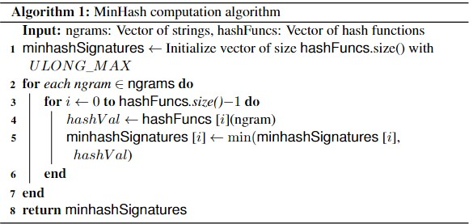
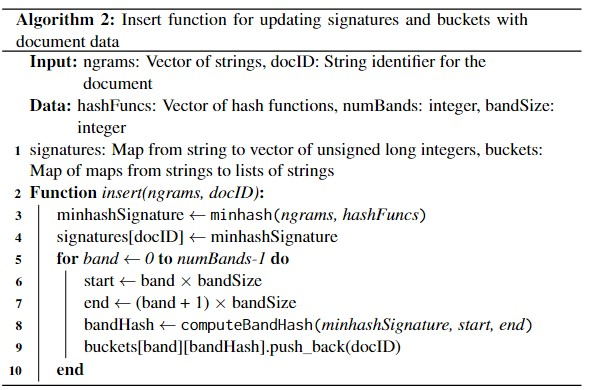
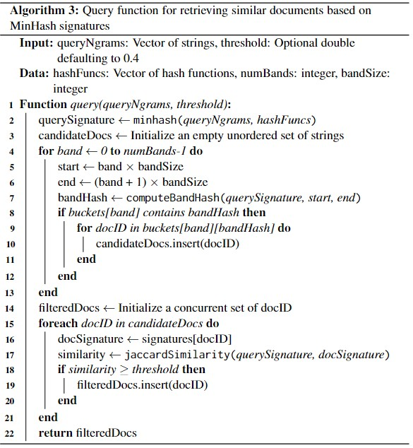

# Summary

Data similarity is essential in data mining and machine learning, especially for tasks like classification, clustering, and retrieval, and is critical in ontology search for improving search precision and performance. Traditional measures such as cosine similarity, Hamming distance, and Jaccard similarity have been widely used, typically framed as the nearest neighbor (NN) problem.

Recent advancements, such as the introduction of practical and optimal Locality-Sensitive Hashing (LSH) for angular distance `[@andoni2015practical]`, have shown that efficient similarity computation can greatly improve performance in high-dimensional spaces. Ontology matching techniques leveraging word embeddings `[@zhang2014ontology]` and large-scale ontology alignment `[@diallo2014effective]` have demonstrated that integrating deep learning and knowledge rules `[@khoudja2022deep]` can significantly enhance matching accuracy. Additionally, methods like biomedical ontology matching using attention-based bidirectional long short-term memory networks `[@hao2021medto; @zhu2022integrating]` have set new benchmarks for precision in complex datasets.

To address these challenges, we developed the LSH Ontology Matching software(https://github.com/Iconoclastic0428/OntologyMatching), which uses hash functions to efficiently group similar items, reducing computational complexity. This tool handles large-scale datasets, offering robust solutions for ontology matching and similarity searches, and includes features for constructing and querying LSH mappings.

# Statement of Need

Ontology matching is critical in data integration, semantic web, and information retrieval applications, where the goal is to identify semantically equivalent concepts across different ontologies `[@shvaiko2011ontology]`. Traditional similarity measures like cosine similarity and Jaccard similarity can be computationally intensive, especially with large datasets `[@euzenat2007ontology]`. Recent advancements in embedding techniques, such as triplet neural networks, have shown promise in improving the efficiency of ontology matching, but they still face scalability challenges `[@zhu2022integrating; @chen2021owl2vec]`. To address these challenges, LSH Ontology Matching provides a scalable solution by leveraging LSH to perform approximate nearest neighbor searches efficiently `[@cochez2014locality; @duan2012instance]`. This software fills a gap in existing tools by offering an open-source, high-performance solution for ontology matching tasks, making it accessible to researchers and practitioners across various domains `[@xue2021biomedical]`.

# Implementation

In this section, we describe the implementation of a parallelized MinHash algorithm designed to efficiently construct and query an LSH mapping based on data extracted from an ontology. This approach leverages the inherent efficiencies of MinHash to handle high-dimensional data spaces typical of ontological structures, facilitating rapid and approximate nearest-neighbor searches.

## NGram
The choice to use n-grams as inputs for the MinHash algorithm aims to capture local context within a text by considering sequences of characters or words. This local context is crucial for understanding similarity in textual data where the arrangement of characters or words can significantly influence meaning. We use two different n-grams in our implementation:

- **Character-based n-grams** break down text into sequences of characters. For example, the string "chat" with n = 3 would produce n-grams like "cha" and "hat." This method is especially useful for languages or datasets where word boundaries are not clear or for tasks like spelling correction and language detection.
- **Word-based n-grams** treat sequences of words as units. This approach is particularly useful for applications that require an understanding of the phrase structure and semantics, such as topic modeling and sentiment analysis.

## MinHash

Here, we examine methods for constructing MinHash signatures, which are essential for the subsequent steps in LSH mapping and querying, particularly when handling high-dimensional datasets derived from ontological structures. The algorithm used to generate these signatures is outlined in the provided pseudocode:



The function provides a calculation of the signature for each NGram input with distinct hash functions provided. Here, we use a $SHA-1$ as the hash function to ensure a high degree of randomness and uniform distribution. By employing multiple instances of hash function with different seeds, the MinHash algorithm can construct a robust and diverse set of hash values for any given set of elements. 


## Similarity Filtering for Ontology

The blocker’s primary function is to reduce the search space by filtering out ontology entity pairs that are unlikely to be equivalent, thereby minimizing unnecessary comparisons during the matching phase. This is achieved by selecting candidate pairs that are likely to represent similar concepts based on predefined criteria. LSH facilitates this process by employing hash functions that group similar items into the same bucket using MinHash signatures and band hashing, where high similarity across multiple bands indicates a stronger overall similarity between signatures.





# Usage

In the following, we use an example ontology from the FoodOn database and a set of recipes to demonstrate the utility of our LSH-based ontology matching system. We start by demonstrating how the data is loaded and preprocessed. Next, we apply the primary matching function to the data. Finally, we summarize the matched results and visualize them.

## Data Loading

FoodOn is a comprehensive ontology that aims to represent entities in the domain of food, from raw ingredients to processed products. It includes classes for various food items, their nutritional attributes, food products, and the relationships between these entities. The recipe dataset consists of a collection of recipes, each containing a list of ingredients. The task is to classify each food ingredient in the recipes to the corresponding entity in the FoodOn ontology. First, we use a Python script to load the ontology file with `owlready2`, process it, and generate a JSON file for the C++ code to process.

```
# Load and process multiple ontology and ingredient files
ontologies = ["ontology1.owl", "ontology2.owl", "ontology3.owl"]
ingredients = ["ingredients1.csv", "ingredients2.csv"]

python3 ProcessOntology.py {ontologies} {output_file}

file <- [output_file]
print(file[0])  # Assuming the file contains a list or similar structure

# Example of a processed entry in the JSON file
"FOODON_03540746": ["scorzonera", "07460 - scorzonera (efsa foodex2)"]
```

The result can be interpreted as the name, processed label, and raw label.

## Data Processing

The primary processing function `EntityMatching::match` implements an efficient process to classify target data based on multiple given ontologies. The function uses Locality-Sensitive Hashing (LSH) to perform approximate nearest neighbor searches, facilitating the matching of large-scale data using multithreading. To use `match()`, we need to specify the number of hash functions `hash_func` and bands `bands`. For illustration, we use the default value `hash_func = 100` and `bands = 25`. `EntityMatching::match` supports the loading of multiple ontology files and multiple target files simultaneously. This allows for a comprehensive comparison across various datasets within a single execution. By passing lists of ontology paths and target paths as arguments, the function processes each ontology-target pair efficiently. The results are then aggregated to provide a single result.

```
results <- match([ontologyPaths], [targetPaths], [outputPath], hash_func=100, bands=25)
print(results[0])

1026765,"Kiwi Banana Shake '{""1 1/2 cups ice""
""1-2 kiwi (or more if you love kiwi)"" 
""1 tablespoon sugar"" ""1-2 banana (used for taste and thickening)""}'"
(FOODON_00004183, banana)
(FOODON_03414363, kiwi)
(FOODON_03420108, sugar)
```

# Visualization

To visualize our performance and its comparison to LexMapr `[@lexmapr]`, a ontological mapper. We illustrate the performance of our LSH-based ontology matching system compared to LexMapr in terms of precision, recall, processing time, and the number of unmatched items.

The graph on the left shows the processing time in seconds for different band settings. There is a noticeable increase in time as the number of bands increases, with a sharp rise at 40 bands. This suggests a trade-off between accuracy and processing time. The graph on the right displays the number of matches that our system found but were not present in LexMapr's results. Our system consistently finds additional matches across different band settings, highlighting an improved performance in identifying relevant ontology matches.

The second graph shows the precision and recall of our system at different band settings for a threshold of 0.5.


# Conclusion
We developed an efficient LSH-based ontology matching system that significantly improves the classification of food ingredients into ontology entities, addressing limitations in existing methods such as LexMapr. This project demonstrates the enhanced precision and recall, as well as the ability to discover additional relevant matches, providing robust and accurate results. Our approach balances accuracy and processing time, ensuring practical applicability in large-scale data environments. Details of usage can be found at (https://github.com/Iconoclastic0428/OntologyMatching)